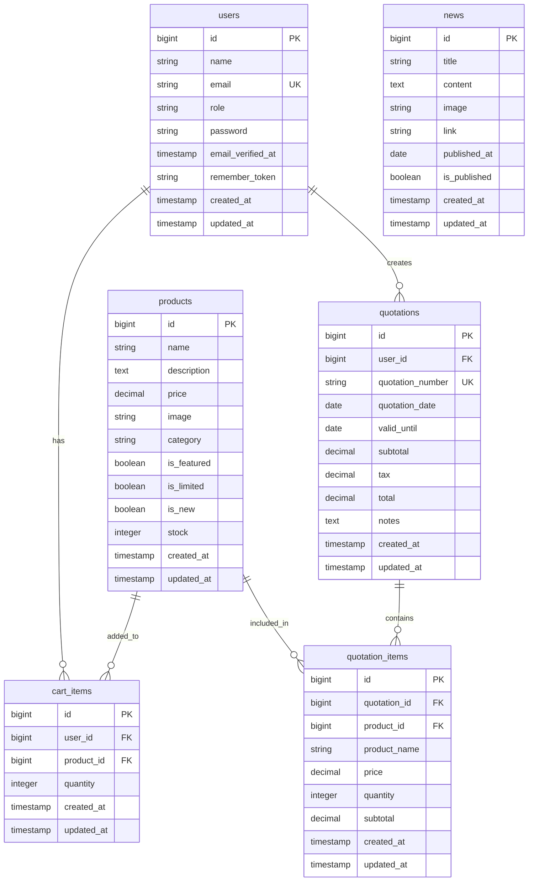

# SOUWA - データベース設計書

## 📋 ドキュメント情報

**プロジェクト名**: SOUWA（送和）- 厳選最高品質日本食材 卸売直送サイト  
**データベースタイプ**: SQLite（開発環境）/ MySQL / PostgreSQL対応  
**設計日**: 2025年12月8日  
**最終更新**: 2025年12月10日  
**バージョン**: 1.0

---

## 📊 データベース概要

### データベース構成
- **データベース名**: `database.sqlite`（SQLiteの場合）
- **文字コード**: UTF-8
- **外部キー制約**: 有効
- **トランザクション**: サポート

### テーブル一覧
本システムは以下の14テーブルで構成されています：

1. **users** - ユーザー情報
2. **products** - 商品情報
3. **cart_items** - カートアイテム
4. **quotations** - 見積書
5. **quotation_items** - 見積書明細
6. **news** - ニュース・お知らせ
7. **migrations** - マイグレーション履歴（Laravel標準）
8. **sessions** - セッション管理（Laravel標準）
9. **cache** - キャッシュ（Laravel標準）
10. **cache_locks** - キャッシュロック（Laravel標準）
11. **jobs** - ジョブキュー（Laravel標準）
12. **job_batches** - ジョブバッチ（Laravel標準）
13. **failed_jobs** - 失敗したジョブ（Laravel標準）
14. **password_reset_tokens** - パスワードリセットトークン（Laravel標準）

---

## 🔗 ER図（Entity Relationship Diagram）



---

## 📋 テーブル詳細仕様

### 1. users（ユーザー情報）

#### テーブル概要
システムに登録されているユーザー（一般ユーザー・管理者）の情報を管理します。

#### カラム定義

| カラム名 | データ型 | 制約 | デフォルト値 | 説明 |
|---------|---------|------|------------|------|
| id | BIGINT | PRIMARY KEY, AUTO_INCREMENT | - | ユーザーID（主キー） |
| name | VARCHAR(255) | NOT NULL | - | ユーザー名 |
| email | VARCHAR(255) | NOT NULL, UNIQUE | - | メールアドレス（ユニーク） |
| role | VARCHAR(255) | NOT NULL | 'user' | ユーザーロール（'user' / 'admin'） |
| password | VARCHAR(255) | NOT NULL | - | パスワード（ハッシュ化） |
| email_verified_at | TIMESTAMP | NULL | NULL | メール認証日時 |
| remember_token | VARCHAR(100) | NULL | NULL | ログイン状態保持トークン |
| created_at | TIMESTAMP | NULL | CURRENT_TIMESTAMP | 作成日時 |
| updated_at | TIMESTAMP | NULL | CURRENT_TIMESTAMP | 更新日時 |

#### インデックス
- PRIMARY KEY: `id`
- UNIQUE: `email`
- INDEX: `email`（検索用）

#### ビジネスルール
- `role`は`'user'`（一般ユーザー）または`'admin'`（管理者）のみ許可
- `email`はシステム内でユニークである必要がある
- `password`はbcryptでハッシュ化して保存
- 管理者は商品管理・NEWS管理機能にアクセス可能

#### リレーション
- **hasMany**: `cart_items`（1対多）
- **hasMany**: `quotations`（1対多）

---

### 2. products（商品情報）

#### テーブル概要
販売する商品の情報を管理します。管理者が商品の登録・編集・削除を行います。

#### カラム定義

| カラム名 | データ型 | 制約 | デフォルト値 | 説明 |
|---------|---------|------|------------|------|
| id | BIGINT | PRIMARY KEY, AUTO_INCREMENT | - | 商品ID（主キー） |
| name | VARCHAR(255) | NOT NULL | - | 商品名 |
| description | TEXT | NULL | NULL | 商品説明 |
| price | DECIMAL(10,2) | NOT NULL | - | 価格（税抜） |
| image | VARCHAR(255) | NULL | NULL | 商品画像パス |
| category | VARCHAR(255) | NULL | NULL | カテゴリー |
| stock | INTEGER | NOT NULL | 0 | 在庫数 |
| is_featured | BOOLEAN | NOT NULL | false | おすすめ商品フラグ |
| is_limited | BOOLEAN | NOT NULL | false | 期間限定商品フラグ |
| is_new | BOOLEAN | NOT NULL | false | 新商品フラグ |
| created_at | TIMESTAMP | NULL | CURRENT_TIMESTAMP | 作成日時 |
| updated_at | TIMESTAMP | NULL | CURRENT_TIMESTAMP | 更新日時 |

#### インデックス
- PRIMARY KEY: `id`
- INDEX: `category`（カテゴリーフィルター用）
- INDEX: `is_featured`（おすすめ商品検索用）
- INDEX: `is_limited`（期間限定商品検索用）
- INDEX: `is_new`（新商品検索用）

#### カテゴリー一覧
以下の8カテゴリーが利用可能：
- 野菜
- 果物
- 肉類
- 魚介類
- 米・穀物
- 調味料
- 飲料
- その他

#### ビジネスルール
- `price`は0以上の値である必要がある
- `stock`は0以上の整数である必要がある
- `image`は`storage/app/public/products/`に保存される
- 商品削除時、関連する`cart_items`も自動削除（CASCADE）

#### リレーション
- **hasMany**: `cart_items`（1対多）
- **hasMany**: `quotation_items`（1対多）

---

### 3. cart_items（カートアイテム）

#### テーブル概要
ユーザーがカートに追加した商品の情報を管理します。ユーザーごとに独立したカートを持ちます。

#### カラム定義

| カラム名 | データ型 | 制約 | デフォルト値 | 説明 |
|---------|---------|------|------------|------|
| id | BIGINT | PRIMARY KEY, AUTO_INCREMENT | - | カートアイテムID（主キー） |
| user_id | BIGINT | NOT NULL, FOREIGN KEY | - | ユーザーID（外部キー） |
| product_id | BIGINT | NOT NULL, FOREIGN KEY | - | 商品ID（外部キー） |
| quantity | INTEGER | NOT NULL | 1 | 数量 |
| created_at | TIMESTAMP | NULL | CURRENT_TIMESTAMP | 作成日時 |
| updated_at | TIMESTAMP | NULL | CURRENT_TIMESTAMP | 更新日時 |

#### インデックス
- PRIMARY KEY: `id`
- FOREIGN KEY: `user_id` → `users.id`（ON DELETE CASCADE）
- FOREIGN KEY: `product_id` → `products.id`（ON DELETE CASCADE）
- INDEX: `user_id`（ユーザーごとのカート検索用）
- INDEX: `product_id`（商品ごとの検索用）

#### ビジネスルール
- `quantity`は1以上の整数である必要がある
- 同一ユーザー・同一商品の組み合わせは1レコードのみ（アプリケーション層で制御）
- 商品削除時、関連するカートアイテムも自動削除（CASCADE）
- ユーザー削除時、関連するカートアイテムも自動削除（CASCADE）
- 数量は商品の在庫数以下である必要がある（アプリケーション層で制御）

#### リレーション
- **belongsTo**: `users`（多対1）
- **belongsTo**: `products`（多対1）

#### 計算項目
- `subtotal`（小計）: `product.price * quantity`（アクセサで計算）

---

### 4. quotations（見積書）

#### テーブル概要
ユーザーが作成した見積書の情報を管理します。見積書はカート内容から生成されます。

#### カラム定義

| カラム名 | データ型 | 制約 | デフォルト値 | 説明 |
|---------|---------|------|------------|------|
| id | BIGINT | PRIMARY KEY, AUTO_INCREMENT | - | 見積書ID（主キー） |
| user_id | BIGINT | NOT NULL, FOREIGN KEY | - | ユーザーID（外部キー） |
| quotation_number | VARCHAR(255) | NOT NULL, UNIQUE | - | 見積書番号（ユニーク） |
| quotation_date | DATE | NOT NULL | - | 見積書作成日 |
| valid_until | DATE | NULL | NULL | 有効期限 |
| subtotal | DECIMAL(10,2) | NOT NULL | 0.00 | 小計（税抜） |
| tax | DECIMAL(10,2) | NOT NULL | 0.00 | 消費税（10%） |
| total | DECIMAL(10,2) | NOT NULL | 0.00 | 合計金額（税込） |
| notes | TEXT | NULL | NULL | 備考 |
| created_at | TIMESTAMP | NULL | CURRENT_TIMESTAMP | 作成日時 |
| updated_at | TIMESTAMP | NULL | CURRENT_TIMESTAMP | 更新日時 |

#### インデックス
- PRIMARY KEY: `id`
- UNIQUE: `quotation_number`
- FOREIGN KEY: `user_id` → `users.id`（ON DELETE CASCADE）
- INDEX: `user_id`（ユーザーごとの見積書検索用）
- INDEX: `quotation_date`（日付検索用）
- INDEX: `quotation_number`（見積書番号検索用）

#### 見積書番号生成ルール
- 形式: `QT-YYYYMMDD-XXXX`
  - `QT`: 固定プレフィックス
  - `YYYYMMDD`: 作成日（8桁）
  - `XXXX`: 連番（4桁、ゼロパディング）
- 例: `QT-20251208-0001`
- 自動生成（モデルの`boot`メソッドで実装）

#### ビジネスルール
- `quotation_number`はシステム内でユニークである必要がある
- `quotation_date`は現在日付以降である必要がある（アプリケーション層で制御）
- `valid_until`は`quotation_date`以降である必要がある（アプリケーション層で制御）
- `tax`は`subtotal * 0.1`（消費税率10%）で計算
- `total`は`subtotal + tax`で計算
- ユーザー削除時、関連する見積書も自動削除（CASCADE）

#### リレーション
- **belongsTo**: `users`（多対1）
- **hasMany**: `quotation_items`（1対多）

---

### 5. quotation_items（見積書明細）

#### テーブル概要
見積書に含まれる商品の明細情報を管理します。商品情報のスナップショットを保持します。

#### カラム定義

| カラム名 | データ型 | 制約 | デフォルト値 | 説明 |
|---------|---------|------|------------|------|
| id | BIGINT | PRIMARY KEY, AUTO_INCREMENT | - | 見積書明細ID（主キー） |
| quotation_id | BIGINT | NOT NULL, FOREIGN KEY | - | 見積書ID（外部キー） |
| product_id | BIGINT | NOT NULL, FOREIGN KEY | - | 商品ID（外部キー） |
| product_name | VARCHAR(255) | NOT NULL | - | 商品名（スナップショット） |
| price | DECIMAL(10,2) | NOT NULL | - | 単価（スナップショット） |
| quantity | INTEGER | NOT NULL | - | 数量 |
| subtotal | DECIMAL(10,2) | NOT NULL | - | 小計 |
| created_at | TIMESTAMP | NULL | CURRENT_TIMESTAMP | 作成日時 |
| updated_at | TIMESTAMP | NULL | CURRENT_TIMESTAMP | 更新日時 |

#### インデックス
- PRIMARY KEY: `id`
- FOREIGN KEY: `quotation_id` → `quotations.id`（ON DELETE CASCADE）
- FOREIGN KEY: `product_id` → `products.id`（ON DELETE CASCADE）
- INDEX: `quotation_id`（見積書ごとの明細検索用）
- INDEX: `product_id`（商品ごとの検索用）

#### ビジネスルール
- `product_name`と`price`は見積書作成時点の商品情報をスナップショットとして保存
- 商品情報が変更されても、見積書の内容は変更されない
- `subtotal`は`price * quantity`で計算
- `quantity`は1以上の整数である必要がある
- 見積書削除時、関連する明細も自動削除（CASCADE）
- 商品削除時、関連する明細は削除されない（商品IDは保持、商品情報は参照不可）

#### リレーション
- **belongsTo**: `quotations`（多対1）
- **belongsTo**: `products`（多対1、nullable）

---

### 6. news（ニュース・お知らせ）

#### テーブル概要
サイト上で公開するニュース・お知らせの情報を管理します。管理者が登録・編集・削除を行います。

#### カラム定義

| カラム名 | データ型 | 制約 | デフォルト値 | 説明 |
|---------|---------|------|------------|------|
| id | BIGINT | PRIMARY KEY, AUTO_INCREMENT | - | ニュースID（主キー） |
| title | VARCHAR(255) | NOT NULL | - | タイトル |
| content | TEXT | NULL | NULL | 内容 |
| image | VARCHAR(255) | NULL | NULL | 画像パス |
| link | VARCHAR(255) | NULL | NULL | リンクURL |
| published_at | DATE | NULL | NULL | 公開日 |
| is_published | BOOLEAN | NOT NULL | false | 公開フラグ |
| created_at | TIMESTAMP | NULL | CURRENT_TIMESTAMP | 作成日時 |
| updated_at | TIMESTAMP | NULL | CURRENT_TIMESTAMP | 更新日時 |

#### インデックス
- PRIMARY KEY: `id`
- INDEX: `is_published`（公開済みニュース検索用）
- INDEX: `published_at`（公開日検索用）
- INDEX: `created_at`（作成日時検索用）

#### ビジネスルール
- `is_published`が`true`の場合のみ一般ユーザーに表示
- `published_at`が設定されている場合、その日付以降に公開
- `published_at`が`NULL`の場合、`is_published`が`true`なら即座に公開
- `image`は`storage/app/public/news/`に保存される
- `link`は外部URLへのリンク（任意）

#### リレーション
- なし（独立テーブル）

---

## 🔑 外部キー制約

### 外部キー一覧

| テーブル | カラム | 参照先テーブル | 参照先カラム | 削除時の動作 |
|---------|--------|---------------|-------------|------------|
| cart_items | user_id | users | id | CASCADE |
| cart_items | product_id | products | id | CASCADE |
| quotations | user_id | users | id | CASCADE |
| quotation_items | quotation_id | quotations | id | CASCADE |
| quotation_items | product_id | products | id | CASCADE |
| sessions | user_id | users | id | SET NULL |

### CASCADE削除の動作
- **users削除時**: 関連する`cart_items`と`quotations`が自動削除
- **products削除時**: 関連する`cart_items`が自動削除、`quotation_items`は保持（商品IDのみ保持）
- **quotations削除時**: 関連する`quotation_items`が自動削除

---

## 📈 データ型マッピング

### SQLite → Laravel型マッピング

| SQLite型 | Laravel型 | PHP型 | 説明 |
|---------|----------|------|------|
| INTEGER | BIGINT | int | 整数（主キー、外部キー、数値） |
| TEXT | VARCHAR/TEXT | string | 文字列 |
| REAL | DECIMAL | float | 浮動小数点数 |
| NUMERIC | DECIMAL(10,2) | string | 金額（10桁、小数点以下2桁） |
| BOOLEAN | BOOLEAN | bool | 真偽値（0/1） |
| TIMESTAMP | TIMESTAMP | Carbon | 日時 |
| DATE | DATE | Carbon | 日付 |

---

## 🔍 インデックス戦略

### プライマリインデックス
すべてのテーブルに`id`カラムにプライマリインデックスが設定されています。

### ユニークインデックス
- `users.email`: メールアドレスのユニーク性を保証
- `quotations.quotation_number`: 見積書番号のユニーク性を保証

### 検索用インデックス
- `products.category`: カテゴリーフィルター用
- `products.is_featured`, `products.is_limited`, `products.is_new`: フラグ検索用
- `cart_items.user_id`: ユーザーごとのカート検索用
- `quotations.user_id`: ユーザーごとの見積書検索用
- `quotations.quotation_date`: 日付検索用
- `news.is_published`, `news.published_at`: 公開済みニュース検索用

---

## 📊 データ整合性ルール

### 必須項目（NOT NULL）
- **users**: `name`, `email`, `role`, `password`
- **products**: `name`, `price`, `stock`, `is_featured`, `is_limited`, `is_new`
- **cart_items**: `user_id`, `product_id`, `quantity`
- **quotations**: `user_id`, `quotation_number`, `quotation_date`, `subtotal`, `tax`, `total`
- **quotation_items**: `quotation_id`, `product_id`, `product_name`, `price`, `quantity`, `subtotal`
- **news**: `title`, `is_published`

### ユニーク制約
- `users.email`: メールアドレスはシステム内でユニーク
- `quotations.quotation_number`: 見積書番号はシステム内でユニーク

### チェック制約（アプリケーション層）
- `products.price`: 0以上
- `products.stock`: 0以上の整数
- `cart_items.quantity`: 1以上の整数、かつ商品の在庫数以下
- `quotation_items.quantity`: 1以上の整数
- `quotation_items.subtotal`: `price * quantity`と一致
- `quotations.tax`: `subtotal * 0.1`と一致
- `quotations.total`: `subtotal + tax`と一致

---

## 🔄 トランザクション設計

### トランザクションが必要な処理

1. **見積書作成**
   - `quotations`テーブルへのINSERT
   - `quotation_items`テーブルへの複数INSERT
   - `cart_items`テーブルからの削除
   - すべて成功するか、すべてロールバック

2. **商品削除**
   - `products`テーブルからの削除
   - 関連する`cart_items`の自動削除（CASCADE）
   - 画像ファイルの削除

---

## 📝 データベース設計の考慮事項

### 1. スナップショット設計
`quotation_items`テーブルでは、見積書作成時点の商品情報（`product_name`, `price`）を保存しています。これにより、商品情報が変更されても見積書の内容は変更されません。

### 2. ソフトデリート
現在は物理削除（HARD DELETE）を採用しています。将来的にソフトデリート（`deleted_at`カラム追加）を検討する場合は、以下のテーブルに追加を推奨：
- `products`
- `news`
- `users`（管理者のみ）

### 3. 監査ログ
現在は監査ログ機能は実装されていません。将来的に必要になる場合は、以下のテーブルを追加：
- `audit_logs`: 操作履歴を記録

### 4. パフォーマンス最適化
- インデックスは適切に設定済み
- 大量データを想定する場合は、パーティショニングを検討
- 画像ファイルは外部ストレージ（S3等）への移行を推奨

---

## 🚀 マイグレーション実行順序

マイグレーションファイルは以下の順序で実行されます：

1. `0001_01_01_000000_create_users_table.php` - ユーザーテーブル作成
2. `2025_12_08_134403_add_role_to_users_table.php` - ユーザーテーブルにroleカラム追加
3. `2025_12_08_134326_create_products_table.php` - 商品テーブル作成
4. `2025_12_08_134326_create_cart_items_table.php` - カートアイテムテーブル作成
5. `2025_12_08_134326_create_quotations_table.php` - 見積書テーブル作成
6. `2025_12_08_134326_create_quotation_items_table.php` - 見積書明細テーブル作成
7. `2025_12_08_150735_create_news_table.php` - ニューステーブル作成

---

## 📋 データベースバックアップ・リストア

### SQLiteの場合
```bash
# バックアップ
cp database/database.sqlite database/database.sqlite.backup

# リストア
cp database/database.sqlite.backup database/database.sqlite
```

### MySQL/PostgreSQLの場合
```bash
# バックアップ（MySQL）
mysqldump -u username -p database_name > backup.sql

# リストア（MySQL）
mysql -u username -p database_name < backup.sql
```

---

## ✅ データベース設計レビューチェックリスト

- [x] 正規化（第3正規形まで）
- [x] 主キーの設定
- [x] 外部キー制約の設定
- [x] インデックスの適切な設定
- [x] データ型の適切な選択
- [x] NULL制約の適切な設定
- [x] デフォルト値の設定
- [x] ユニーク制約の設定
- [x] CASCADE削除の適切な設定
- [x] ビジネスルールの文書化

---

**最終更新日**: 2025年12月10日  
**設計者**: 開発チーム  
**承認者**: -  
**バージョン**: 1.0

